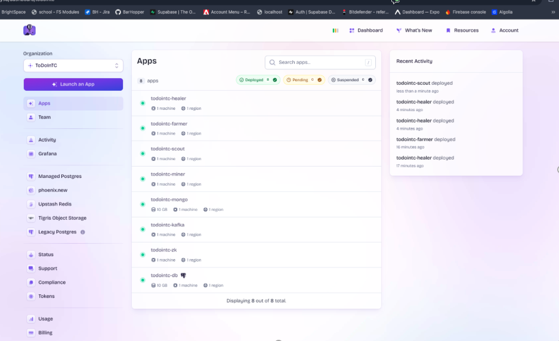

# CS 499 Capstone – ToDoInTC ePortfolio

This is the public, in-browser view of my CS 499 capstone. It dual-publishes the required Word documents alongside readable pages so instructors can review without downloads while keeping the formal `.docx` submissions intact.

> **Formal self-assessment (Word):** [Download](./professional-self-assessment.docx)

## Professional Self-Assessment (Readable)
I entered the program focused on building reliable backend systems and graduated with a stronger balance of software engineering discipline, data structure rigor, and data integrity practices. Through ToDoInTC, I learned to design for operational safety (blue-green deploys), reason about deterministic scraping algorithms, and tighten database correctness while controlling costs.

### Program Outcomes & Evidence
- **Design & Implementation:** Delivered environment separation and zero-downtime releases to support safer production changes.
- **Algorithms & Data Structures:** Added deterministic URL selection and run-state tracking to make ingestion predictable and testable.
- **Data Management:** Implemented pre-validation to cut duplicate writes and reduce token spend while improving data quality across PostgreSQL and MongoDB.
- **Professional Communication:** Produced dual-published narratives and code review materials that are easy to consume in-browser and via formal Word submissions.

### Technical & Professional Growth
- Strengthened deployment discipline (rollout/rollback playbooks, health checks, observability expectations).
- Improved defensive programming habits for ingestion pipelines: clear validation gates and bounded scopes for expensive work.

### Next Steps
- Automate more runtime safeguards (alerting tied to ingestion anomalies, synthetic checks on deployment).
- Extend duplicate-prevention heuristics with embeddings for fuzzy matching while maintaining cost guardrails.
- Broaden test coverage with scenario-based integration runs for scraper inputs and storage pathways.

## Read in Browser
- Professional Self-Assessment (this page)
- [Code Review](./code-review)
- [Enhancement One — Software Engineering & Design](./software-engineering)
- [Enhancement Two — Algorithms & Data Structures](./algorithms)
- [Enhancement Three — Databases](./databases)

## Official Word Submissions
- [Professional Self-Assessment](./professional-self-assessment.docx)
- [Enhancement One — Software Engineering & Design](./narratives/enhancement-one-software-engineering.docx)
- [Enhancement Two — Algorithms & Data Structures](./narratives/enhancement-two-algorithms-data-structures.docx)
- [Enhancement Three — Databases](./narratives/enhancement-three-databases.docx)

## Artifact Context
- **Project:** ToDoInTC backend — distributed ingestion pipeline for Traverse City events
- **Focus areas:** safer deployments, deterministic scraping controls, and data integrity safeguards across software engineering, algorithms, and databases
- **Source (private):** https://github.com/dy1b0t/todointc (instructor access on request)

Eight Fly.io services are shown: scraper workers (4 agent pipeline), Kafka and Zookeeper to track and regulate flow, MongoDB, and PostgresDB. The dashboard illustrates how the services are isolated yet coordinated for safe releases and controlled ingestion.